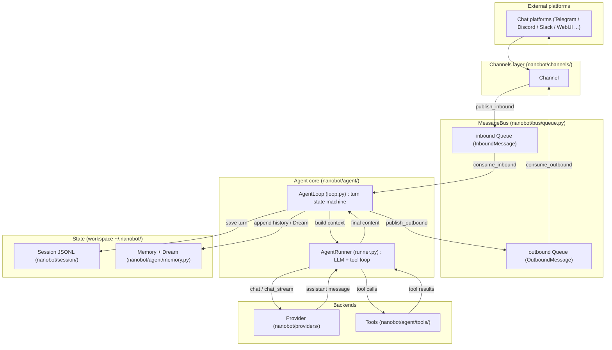

# nanobot 코드베이스 학습 노트 — 최상위 목차

> **이 문서에서 다루는 큰 맥락**
>
> 이 `STUDY_NOTES/` 디렉토리는 `nanobot`(패키지 이름 `nanobot-ai`) 저장소의 전체 소스코드와
> 그 배경 기술을 **큰 그림 → 중간 구조/흐름 → 세부 구성요소 → 코드 라인바이라인** 순서로
> 이해하기 위한 한국어 학습자료입니다. 이 문서(`00_index.md`)는 그 관문으로,
> (a) 전체 문서 목차와 링크, (b) 저장소 아키텍처 다이어그램, (c) 전문 용어집을 제공합니다.
>
> nanobot은 한 줄로 요약하면 **"채팅 채널로 들어온 메시지를 받아 → LLM을 호출하고 → 도구를 실행하고
> → 세션/메모리를 관리해 응답을 돌려주는 경량 개인 AI 에이전트 프레임워크"** 입니다
> (근거: <a href="../AGENTS.md">AGENTS.md</a> "Project Overview", <a href="../pyproject.toml">pyproject.toml</a> L2-L4).

---

## 이 문서의 소목차

1. [학습 순서와 문서 목차](#학습-순서와-문서-목차)
2. [저장소 아키텍처 다이어그램](#저장소-아키텍처-다이어그램)
3. [핵심 데이터 흐름 한눈에 보기](#핵심-데이터-흐름-한눈에-보기)
4. [전문 용어집 (Glossary)](#전문-용어집-glossary)
5. [이 학습 노트를 읽는 방법](#이-학습-노트를-읽는-방법)

---

## 학습 순서와 문서 목차

아래 순서대로 읽으면 "전체 그림"에서 시작해 점점 세부로 내려갑니다.

### A. 전체 그림 (Big picture)

| 문서 | 내용 |
| --- | --- |
| [01_source_overview.md](01_source_overview.md) | 전체 소스코드 구조 지도: `nanobot/` 이하 디렉토리 역할, 최상위 모듈, 진입점, 사용 언어 |
| [02_modules_and_stack.md](02_modules_and_stack.md) | 기술 스택/의존성: `pyproject.toml`의 필수/선택 의존성 분류, lazy deps, 버전 고정 전략 |
| [03_entrypoints.md](03_entrypoints.md) | 진입점: `__main__.py` → `cli/commands.py`의 Typer 앱과 하위 명령들 |

### B. 에이전트 핵심 (Core engine)

| 문서 | 내용 |
| --- | --- |
| [04_agent_loop.md](04_agent_loop.md) | 두뇌: `agent/loop.py`의 `AgentLoop` 상태머신과 `agent/runner.py`의 `AgentRunner`, `bus/`의 메시지 흐름 |
| [05_tools.md](05_tools.md) | 도구 계층: `agent/tools/`의 자기등록·디스패치·자동 발견과 대표 도구 |
| [06_state_and_persistence.md](06_state_and_persistence.md) | 상태/영속성: JSONL 세션과 워크스페이스 메모리, 세션 키/압축 |
| [07_prompt_and_context.md](07_prompt_and_context.md) | 프롬프트/컨텍스트: `agent/context.py`, `context_governance.py`, `autocompact.py`, `templates/` |
| [08_memory_and_dream.md](08_memory_and_dream.md) | 장기 메모리와 Dream(자기개선), Skills 주입 |

### C. 주변 시스템 (Surrounding systems)

| 문서 | 내용 |
| --- | --- |
| [09_providers.md](09_providers.md) | LLM 프로바이더: `providers/`의 base/registry/factory/fallback과 구현체 |
| [10_gateway_and_channels.md](10_gateway_and_channels.md) | 게이트웨이/채널: `gateway/`, `channels/`와 새 채널 추가 절차 |
| [11_cron_and_triggers.md](11_cron_and_triggers.md) | 스케줄링/트리거: `cron/`, `triggers/`, croniter 기반 실행 흐름 |
| [12_security_and_sandbox.md](12_security_and_sandbox.md) | 보안/격리: `security/`, 셸 샌드박싱, 워크스페이스 스코프 |
| [13_api_sdk_webui.md](13_api_sdk_webui.md) | API 서버/SDK/WebUI: OpenAI 호환 서버, Python SDK, 번들 WebUI |

### D. 배경 기술 (Technology background)

| 문서 | 내용 |
| --- | --- |
| [tech_background/01_tool_calling_agents.md](tech_background/01_tool_calling_agents.md) | Tool-calling / function-calling 에이전트 |
| [tech_background/02_context_compression.md](tech_background/02_context_compression.md) | 컨텍스트 압축 (AutoCompact, tiktoken) |
| [tech_background/03_self_improving_agents.md](tech_background/03_self_improving_agents.md) | 자기개선 에이전트: Dream + Skills |
| [tech_background/04_mcp.md](tech_background/04_mcp.md) | Model Context Protocol (MCP) |
| [tech_background/05_model_routing_fallback.md](tech_background/05_model_routing_fallback.md) | 모델 라우팅 / 폴백 |
| [tech_background/06_execution_isolation.md](tech_background/06_execution_isolation.md) | 실행 격리 / 샌드박싱 |

> 참고: 원 저장소의 상위 개념 문서인 <a href="../docs/architecture.md">docs/architecture.md</a>와
> <a href="../docs/concepts.md">docs/concepts.md</a>도 함께 보면 좋습니다. 이 학습 노트는 그 문서들을
> 초보자 관점에서 "코드 라인 근거"와 함께 다시 풀어 쓴 것입니다.

---

## 저장소 아키텍처 다이어그램

아래 다이어그램은 nanobot의 런타임 데이터 흐름을 나타냅니다.
`AGENTS.md`의 "Core Data Flow" 절과 실제 코드(`nanobot/bus/queue.py`, `nanobot/agent/loop.py`,
`nanobot/agent/runner.py`)에 근거합니다. (색상은 사용하지 않으며, 모든 라벨은 큰따옴표로 감쌉니다.)

---

## 핵심 데이터 흐름 한눈에 보기

문장으로 다시 정리하면 다음과 같습니다 (근거: <a href="../AGENTS.md">AGENTS.md</a> "Core Data Flow",
`nanobot/agent/loop.py` L182-L192의 상태 전이표):

1. **Channel**이 외부 플랫폼 메시지를 받아 `InboundMessage`로 만들어 **MessageBus**의 inbound 큐에 넣는다.
2. **AgentLoop**이 inbound 큐에서 메시지를 꺼내(`consume_inbound`), 세션/워크스페이스를 결정하고 컨텍스트를 만든다.
3. **AgentRunner**가 **Provider**(LLM)를 호출하고, LLM이 요청한 **Tool**을 실행하며, 스트리밍 델타를 흘려보낸다.
4. 결과는 세션(**Session JSONL**)과 **Memory**에 저장되고, `OutboundMessage`로 만들어져 outbound 큐를 거쳐 다시 **Channel**로 나간다.

즉 `Channel -> MessageBus -> AgentLoop -> AgentRunner -> Provider/Tools -> Outbound` 흐름입니다.

---

## 전문 용어집 (Glossary)

아래 용어는 이 학습 노트 전반에서 반복적으로 등장합니다. 각 용어는 (1) 일반적 정의와
(2) 이 코드베이스에서의 구체적 의미를 함께 적었습니다.

- **Agent loop (에이전트 루프)** — 일반적으로 "관찰 → 판단(LLM) → 행동(도구 실행) → 다시 관찰"을
  반복하는 순환. 이 반복이 있어야 LLM이 한 번의 답변에 그치지 않고 도구를 여러 번 써가며 목표를 달성한다.
  nanobot에서는 두 개의 루프가 구분된다: **바깥 루프**는 `AgentLoop`(메시지 단위, `agent/loop.py`),
  **안쪽 루프**는 `AgentRunner`(한 메시지 처리 중 LLM↔도구 반복, `agent/runner.py` L377 `for iteration in range(...)`).

- **MessageBus** — 생산자와 소비자를 큐로 분리(decouple)하는 메시지 버스. nanobot에서는
  `nanobot/bus/queue.py`의 `MessageBus` 클래스로, 두 개의 `asyncio.Queue`(inbound/outbound)를 가진다.
  채널과 에이전트 코어가 서로를 직접 알 필요 없이 큐를 통해서만 통신하게 만든다.

- **AgentLoop** — `nanobot/agent/loop.py`의 클래스. inbound 메시지를 하나씩 소비해 **한 턴(turn)** 을
  상태머신(`TurnState`: RESTORE→COMPACT→COMMAND→BUILD→RUN→SAVE→RESPOND→DONE, L167-L192)으로 처리한다.
  세션 잠금, 컨텍스트 조립, 아웃바운드 발행을 담당한다.

- **AgentRunner** — `nanobot/agent/runner.py`의 클래스. 한 턴 안에서 실제 LLM 대화 루프를 돌린다.
  프로바이더 호출, 스트리밍 델타 처리, 도구 실행, 재시도/폴백, 반복 횟수 제한(`max_iterations`)을 담당한다.

- **Provider (프로바이더)** — LLM 백엔드 추상화. `nanobot/providers/base.py`의 `LLMProvider`가 공통
  인터페이스이고, Anthropic·OpenAI 호환·Azure·Bedrock·GitHub Copilot·OpenAI Codex 등 구현체가 있다.
  `factory.py`가 config에서 프로바이더를 만들고, `fallback_provider.py`가 폴백을 감싼다.

- **Channel (채널)** — 외부 채팅 플랫폼과의 연결부. `nanobot/channels/base.py`가 기반 클래스이고
  Telegram/Discord/Slack 등 구현체가 있다. 메시지를 `InboundMessage`로 변환해 버스에 넣고,
  `OutboundMessage`를 받아 플랫폼 API로 전송한다.

- **Tool (도구)** — LLM이 호출할 수 있는 기능. `nanobot/agent/tools/base.py`의 `Tool` 계약을 따르며,
  파일시스템/셸/웹검색/MCP/cron/서브에이전트 등이 있다. `loader.py`가 `pkgutil`로 자동 발견하고
  `registry.py`가 등록·디스패치한다.

- **Skill (스킬)** — 특정 작업 수행법을 가르치는 마크다운 문서(`SKILL.md`). 코드가 아니라 "지식"이다.
  `nanobot/agent/skills.py`의 `SkillsLoader`가 로드하고, 필요 시 시스템 프롬프트에 주입한다
  (`always` 스킬은 항상, 나머지는 요약만 넣고 필요 시 파일로 읽음).

- **Gateway (게이트웨이)** — 여러 채널·서비스를 한 프로세스에서 장기 실행시키는 오케스트레이터.
  `nanobot gateway` 명령으로 뜨며 `nanobot/gateway/runtime.py`, `service.py`가 담당한다.
  WebUI/HTTP API/WebSocket 엔드포인트를 함께 서빙한다.

- **Session (JSONL 세션)** — 대화 이력을 세션 단위로 보관하는 저장소. nanobot은 **SQLite/FTS5가 아니라**
  워크스페이스 안의 JSONL 파일과 메모리 파일을 사용한다. 세션 키는 기본적으로 `"{channel}:{chat_id}"`
  형식이다(`nanobot/bus/events.py`의 `InboundMessage.session_key`, `nanobot/session/keys.py`).

- **Memory / Dream** — 장기 기억과 자기개선. `MEMORY.md`(장기 메모리) + `history.jsonl`(대화 이력 로그)을
  두고, 주기적으로 **Dream**이라는 통합(consolidation) 과정을 돌려 메모리를 정리한다
  (`nanobot/agent/memory.py`). Dream은 durable 파일(SOUL.md/USER.md/MEMORY.md)을 실제로 편집한다.

- **AutoCompact** — 오래 놀고 있는(idle) 세션의 이력을 미리 압축(compaction)해 토큰 비용과 지연을 줄이는 장치.
  `nanobot/agent/autocompact.py`의 `AutoCompact`가 TTL 기반으로 유휴 세션을 골라 요약으로 대체한다.

- **Subagent (서브에이전트)** — 메인 에이전트가 하위 작업을 위임하기 위해 생성하는 별도 에이전트.
  `spawn` 도구(`nanobot/agent/tools/spawn.py`)와 `nanobot/agent/subagent.py`의 `SubagentManager`가 담당한다.

- **MCP (Model Context Protocol)** — 외부 도구/데이터 소스를 표준 프로토콜로 LLM에 연결하는 규격.
  nanobot은 `mcp` 패키지에 의존하며(`pyproject.toml` L42), `nanobot/agent/tools/mcp.py`로 MCP 서버를
  도구로 통합한다.

- **Lazy deps (지연 의존성)** — 무겁거나 특정 채널/기능에만 필요한 패키지를 항상 설치하지 않고,
  `pyproject.toml`의 `optional-dependencies`(extras)로 분리해 필요할 때만 설치하는 설계.
  `nanobot/optional_features.py`가 미설치 시 친절한 안내를 제공한다.

- **Exact pinning / 버전 상·하한 고정** — 의존성 버전에 하한(`>=`)과 상한(`<`)을 함께 두는 방식.
  예: `"anthropic>=0.45.0,<1.0.0"`(`pyproject.toml` L27). 재현성과 호환성 사이의 트레이드오프를 관리한다
  (자세한 논의는 [02_modules_and_stack.md](02_modules_and_stack.md)).

- **Sandbox (샌드박스)** — 셸/코드 실행을 격리해 시스템을 보호하는 장치. `nanobot/agent/tools/sandbox.py`,
  `exec_session.py`, `shell.py`와 `nanobot/security/`가 워크스페이스 스코프·네트워크 체크를 수행한다.

---

## 이 학습 노트를 읽는 방법

- 각 문서는 상단에 **"이 문서에서 다루는 큰 맥락"** 요약과 **내부 소목차**를 둡니다.
- 서술 순서는 항상 **큰 그림 → 구조/흐름 → 세부 → 라인바이라인** 입니다.
- 본문은 한국어지만 **코드 식별자·파일 경로·함수/클래스명은 영어 원문**을 유지합니다.
- 모든 코드 인용은 실제 파일을 열어 확인한 **파일 경로와 라인 번호**에 근거합니다.
- 처음이라면 [01_source_overview.md](01_source_overview.md)부터 순서대로 읽는 것을 권장합니다.
