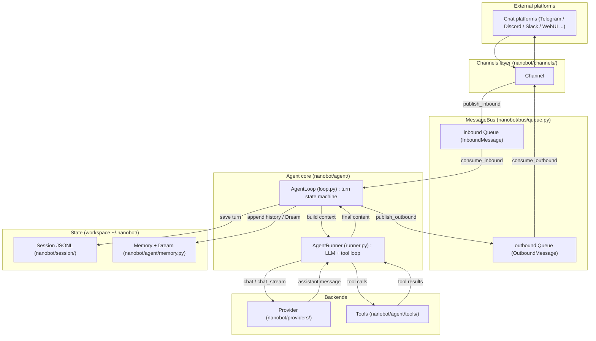

# nanobot 코드베이스 학습 노트 — 최상위 목차

> **이 문서에서 다루는 큰 맥락**
>
> 이 `STUDY_NOTES/` 디렉토리는 `nanobot`(패키지 이름 `nanobot-ai`) 저장소의 전체 소스코드와
> 그 배경 기술을 **큰 그림 → 중간 구조/흐름 → 세부 구성요소 → 코드 라인바이라인** 순서로
> 이해하기 위한 한국어 학습자료입니다. 이 문서(`00_index.md`)는 그 관문으로,
> (a) 전체 문서 목차와 링크, (b) 저장소 아키텍처 다이어그램, (c) 전문 용어집을 제공합니다.
>
> nanobot은 한 줄로 요약하면 **"채팅 채널로 들어온 메시지를 받아 → LLM을 호출하고 → 도구를 실행하고
> → 세션/메모리를 관리해 응답을 돌려주는 경량 개인 AI 에이전트 프레임워크"** 입니다
> (근거: <a href="../AGENTS.md">AGENTS.md</a> "Project Overview", <a href="../pyproject.toml">pyproject.toml</a> L2-L4).

---

## 비유로 먼저 이해하기 — nanobot은 "AI 비서 사무실"

nanobot을 처음 보는 분을 위해, 어려운 말 없이 전체 그림부터 그려 보겠습니다.

nanobot은 **"메신저로 말을 걸면 대신 일해 주는 AI 비서"를 만들어 주는 프로그램**입니다.
카카오톡 같은 메신저(여기서는 Telegram, Discord, Slack, 웹 화면)로 "내일 할 일 정리해 줘"라고
보내면, AI가 읽고, 필요하면 컴퓨터에서 파일을 열거나 웹을 검색해서, 답장을 보내 줍니다.

이걸 **작은 사무실**에 비유하면 이렇게 됩니다.

| 사무실 비유 | nanobot의 실제 이름 | 하는 일 |
| --- | --- | --- |
| 안내 데스크 | **Channel** (채널) | 손님(메신저 메시지)을 맞이하고, 답장을 손님에게 되돌려 줌 |
| 접수함 / 발송함 | **MessageBus** (메시지 버스) | 들어온 요청과 나갈 답장을 순서대로 쌓아 두는 상자 |
| 팀장 | **AgentLoop** | 요청을 하나 꺼내 "누가, 어떤 순서로 처리할지" 전 과정을 지휘 |
| 실무 담당자 | **AgentRunner** | AI(두뇌)에게 물어보고, 필요한 도구를 대신 써 주는 사람 |
| 두뇌 (외부 전문가) | **Provider** (LLM) | 실제로 생각하고 글을 만들어 내는 인공지능 (Claude, GPT 등) |
| 공구함 | **Tool** (도구) | 파일 읽기, 웹 검색, 명령 실행처럼 AI가 빌려 쓰는 손발 |
| 업무 일지 | **Session** (세션) | 지금까지의 대화를 한 줄씩 기록해 두는 공책 |
| 장기 기억 노트 | **Memory / Dream** | 중요한 내용만 골라 오래 보관하고, 밤에 정리(Dream)함 |

즉, 메시지 하나가 처리되는 과정은 이렇습니다:

> 안내 데스크(Channel)가 손님의 요청을 접수함(MessageBus)에 넣는다 →
> 팀장(AgentLoop)이 하나 꺼내 업무 일지(Session)를 펼치고 상황을 정리한다 →
> 실무자(AgentRunner)가 두뇌(Provider)에게 물어보고, 두뇌가 "파일 좀 읽어 줘"라고 하면
> 공구함(Tool)에서 도구를 꺼내 쓰고 결과를 다시 두뇌에게 보여 준다(필요한 만큼 반복) →
> 완성된 답을 일지에 적고, 발송함을 거쳐 안내 데스크가 손님에게 전달한다.

이 흐름만 기억하면 아래의 모든 문서가 "사무실의 어느 부분을 확대해서 보는가"로 읽힙니다.
예를 들어 [04_agent_loop.md](04_agent_loop.md)는 팀장과 실무자의 일 처리 순서를,
[05_tools.md](05_tools.md)는 공구함 속 도구들을, [12_security_and_sandbox.md](12_security_and_sandbox.md)는
"도구를 함부로 못 쓰게 막는 안전장치"를 다룹니다.

**꼭 가져가야 할 것 3가지**

1. nanobot = 메신저로 부리는 개인 AI 비서를 만드는 프레임워크.
2. 핵심 흐름은 `Channel → MessageBus → AgentLoop → AgentRunner → Provider/Tools → 다시 Channel`.
3. 대화 기록(Session)과 장기 기억(Memory)은 데이터베이스가 아니라 **일반 파일**(JSONL/마크다운)에 저장된다.

---

## 0교시 — 먼저 알아야 할 최소 배경지식

본격적으로 시작하기 전에, 이 학습 노트 전체에서 계속 쓰일 **여덟 개의 기초 개념**을
짚고 갑니다. 이미 아는 것은 건너뛰어도 됩니다. 여기서는 "nanobot을 읽는 데 필요한 만큼"만
설명하고, 더 깊은 내용은 각 문서와 [tech_background/](tech_background/01_tool_calling_agents.md),
그리고 용어사전([dict/](../dict/README.md))에서 다룹니다.

1. **프로그램과 파이썬(Python)** — 프로그램은 컴퓨터에게 시킬 일을 적은 글이고,
   파이썬은 그 글을 쓰는 언어 중 하나입니다. 문법이 영어 문장에 가까워 읽기 쉬워서
   nanobot의 본체가 파이썬으로 쓰여 있습니다. 파이썬 코드는 `.py` 파일에 들어 있고,
   서로 관련된 `.py` 파일들을 폴더로 묶은 것을 **패키지**라고 부릅니다.
   `nanobot/` 폴더 전체가 하나의 큰 패키지입니다.

2. **라이브러리(library)와 의존성(dependency)** — 남이 미리 만들어 공개해 둔 코드 묶음을
   라이브러리라고 합니다. "바퀴를 다시 발명하지 않기" 위해 가져다 씁니다.
   내 프로그램이 어떤 라이브러리를 필요로 하는지의 목록이 **의존성**이며,
   nanobot의 의존성 목록은 `pyproject.toml` 파일에 적혀 있습니다([02](02_modules_and_stack.md)).

3. **LLM(대형 언어 모델)** — 엄청난 양의 글을 학습해서, 주어진 글 뒤에 이어질 말을
   확률적으로 예측하는 인공지능입니다. ChatGPT의 GPT, Claude 등이 LLM입니다.
   중요한 특징 두 가지: (1) **기억이 없다** — 매번 대화 전체를 다시 보여 줘야 합니다.
   (2) **말만 할 수 있다** — 파일을 열거나 인터넷에 접속하는 능력이 없어서,
   nanobot 같은 프로그램이 손발(도구)을 대신해 줘야 합니다.

4. **토큰(token)** — LLM이 글을 읽고 쓰는 최소 단위입니다. 대략 "단어의 일부~한 단어"
   크기이며, 한글은 보통 글자 1~2개가 토큰 하나가 됩니다. LLM이 한 번에 볼 수 있는
   토큰 수에는 한계(컨텍스트 창)가 있고, 요금도 토큰 수로 매겨집니다.
   그래서 "토큰을 아끼는 기술"(압축, 요약)이 이 코드베이스 곳곳에 나옵니다.

5. **API** — 프로그램끼리 대화하는 창구(규격)입니다. "이 주소로 이런 형식의 요청을 보내면
   이런 형식의 답을 준다"는 약속이죠. nanobot은 Anthropic·OpenAI 같은 회사의 API로
   LLM을 호출하고, Telegram·Discord의 API로 메시지를 주고받습니다.

6. **비동기(asyncio)** — 파이썬에서 "기다리는 동안 다른 일을 하는" 프로그래밍 방식입니다.
   nanobot은 LLM 응답 대기, 메신저 수신 대기처럼 **기다림이 많은** 프로그램이라
   비동기를 전면적으로 씁니다. 코드에서 `async def`(비동기 함수 정의)와
   `await`(여기서 기다리되, 그동안 다른 작업 실행 허용)라는 키워드가 보이면
   "기다림이 있는 일"이라고 읽으면 됩니다.

7. **JSON과 마크다운** — 둘 다 사람이 읽을 수 있는 텍스트 형식입니다.
   **JSON**은 `{"이름": "값"}` 모양의 데이터 표기법으로, 프로그램 간 데이터 교환에 쓰입니다.
   **JSONL**은 "한 줄에 JSON 하나씩"인 파일이고요. **마크다운(.md)**은 `#`으로 제목,
   `-`로 목록을 만드는 문서 형식으로, nanobot은 기억(MEMORY.md)과 스킬(SKILL.md)을
   전부 마크다운 파일로 관리합니다 — 사람이 열어 읽고 고칠 수 있게 하기 위해서입니다.

8. **터미널과 CLI** — 터미널은 글자로 컴퓨터에게 명령을 내리는 창이고,
   CLI(Command-Line Interface)는 그 창에서 쓰는 명령어 체계입니다.
   `nanobot agent`, `nanobot gateway`처럼 타이핑해서 nanobot을 실행합니다([03](03_entrypoints.md)).

이 여덟 가지만 갖추면 이후의 모든 문서를 읽을 준비가 된 것입니다.

---

## 이 문서의 소목차

0. [0교시 — 먼저 알아야 할 최소 배경지식](#0교시--먼저-알아야-할-최소-배경지식)
1. [학습 순서와 문서 목차](#학습-순서와-문서-목차)
2. [저장소 아키텍처 다이어그램](#저장소-아키텍처-다이어그램)
3. [핵심 데이터 흐름 한눈에 보기](#핵심-데이터-흐름-한눈에-보기)
4. [전문 용어집 (Glossary)](#전문-용어집-glossary)
5. [이 학습 노트를 읽는 방법](#이-학습-노트를-읽는-방법)

---

## 학습 순서와 문서 목차

아래 순서대로 읽으면 "전체 그림"에서 시작해 점점 세부로 내려갑니다.

### A. 전체 그림 (Big picture)

| 문서 | 내용 |
| --- | --- |
| [01_source_overview.md](01_source_overview.md) | 전체 소스코드 구조 지도: `nanobot/` 이하 디렉토리 역할, 최상위 모듈, 진입점, 사용 언어 |
| [02_modules_and_stack.md](02_modules_and_stack.md) | 기술 스택/의존성: `pyproject.toml`의 필수/선택 의존성 분류, lazy deps, 버전 고정 전략 |
| [03_entrypoints.md](03_entrypoints.md) | 진입점: `__main__.py` → `cli/commands.py`의 Typer[(용어사전)](../dict/09_dev_stack.md#typer) 앱과 하위 명령들 |

### B. 에이전트 핵심 (Core engine)

| 문서 | 내용 |
| --- | --- |
| [04_agent_loop.md](04_agent_loop.md) | 두뇌: `agent/loop.py`의 `AgentLoop` 상태머신과 `agent/runner.py`의 `AgentRunner`, `bus/`의 메시지 흐름 |
| [05_tools.md](05_tools.md) | 도구 계층: `agent/tools/`의 자기등록·디스패치·자동 발견과 대표 도구 |
| [06_state_and_persistence.md](06_state_and_persistence.md) | 상태/영속성: JSONL[(용어사전)](../dict/03_memory_context_session.md#jsonl) 세션과 워크스페이스 메모리, 세션 키/압축 |
| [07_prompt_and_context.md](07_prompt_and_context.md) | 프롬프트/컨텍스트: `agent/context.py`, `context_governance.py`, `autocompact.py`, `templates/` |
| [08_memory_and_dream.md](08_memory_and_dream.md) | 장기 메모리와 Dream[(용어사전)](../dict/03_memory_context_session.md#dream)(자기개선), Skills 주입 |

### C. 주변 시스템 (Surrounding systems)

| 문서 | 내용 |
| --- | --- |
| [09_providers.md](09_providers.md) | LLM[(용어사전)](../dict/08_ai_llm_concepts.md#llm) 프로바이더: `providers/`의 base/registry/factory/fallback과 구현체 |
| [10_gateway_and_channels.md](10_gateway_and_channels.md) | 게이트웨이/채널: `gateway/`, `channels/`와 새 채널 추가 절차 |
| [11_cron_and_triggers.md](11_cron_and_triggers.md) | 스케줄링/트리거: `cron/`, `triggers/`, croniter[(용어사전)](../dict/06_scheduling_automation.md#croniter) 기반 실행 흐름 |
| [12_security_and_sandbox.md](12_security_and_sandbox.md) | 보안/격리: `security/`, 셸 샌드박싱, 워크스페이스 스코프 |
| [13_api_sdk_webui.md](13_api_sdk_webui.md) | API 서버/SDK/WebUI: OpenAI 호환 서버, Python SDK, 번들 WebUI[(용어사전)](../dict/05_channels_gateway_ui.md#webui) |

### D. 배경 기술 (Technology background)

| 문서 | 내용 |
| --- | --- |
| [tech_background/01_tool_calling_agents.md](tech_background/01_tool_calling_agents.md) | Tool-calling / function-calling 에이전트 |
| [tech_background/02_context_compression.md](tech_background/02_context_compression.md) | 컨텍스트 압축 (AutoCompact[(용어사전)](../dict/03_memory_context_session.md#autocompact), tiktoken[(용어사전)](../dict/08_ai_llm_concepts.md#tiktoken)) |
| [tech_background/03_self_improving_agents.md](tech_background/03_self_improving_agents.md) | 자기개선 에이전트: Dream + Skills |
| [tech_background/04_mcp.md](tech_background/04_mcp.md) | Model Context Protocol (MCP[(용어사전)](../dict/08_ai_llm_concepts.md#mcp)) |
| [tech_background/05_model_routing_fallback.md](tech_background/05_model_routing_fallback.md) | 모델 라우팅 / 폴백 |
| [tech_background/06_execution_isolation.md](tech_background/06_execution_isolation.md) | 실행 격리 / 샌드박싱 |

> 참고: 원 저장소의 상위 개념 문서인 <a href="../docs/architecture.md">docs/architecture.md</a>와
> <a href="../docs/concepts.md">docs/concepts.md</a>도 함께 보면 좋습니다. 이 학습 노트는 그 문서들을
> 초보자 관점에서 "코드 라인 근거"와 함께 다시 풀어 쓴 것입니다.

---

## 저장소 아키텍처 다이어그램

아래 다이어그램은 nanobot의 런타임 데이터 흐름을 나타냅니다.
`AGENTS.md`의 "Core Data Flow" 절과 실제 코드(`nanobot/bus/queue.py`, `nanobot/agent/loop.py`,
`nanobot/agent/runner.py`)에 근거합니다. (색상은 사용하지 않으며, 모든 라벨은 큰따옴표로 감쌉니다.)

---

## 핵심 데이터 흐름 한눈에 보기

문장으로 다시 정리하면 다음과 같습니다 (근거: <a href="../AGENTS.md">AGENTS.md</a> "Core Data Flow",
`nanobot/agent/loop.py` L182-L192의 상태 전이표):

1. **Channel[(용어사전)](../dict/01_core_architecture.md#channel)**이 외부 플랫폼 메시지를 받아 `InboundMessage`로 만들어 **MessageBus[(용어사전)](../dict/01_core_architecture.md#messagebus)**의 inbound 큐에 넣는다.
2. **AgentLoop[(용어사전)](../dict/01_core_architecture.md#agentloop)**이 inbound 큐에서 메시지를 꺼내(`consume_inbound`), 세션/워크스페이스를 결정하고 컨텍스트를 만든다.
3. **AgentRunner[(용어사전)](../dict/01_core_architecture.md#agentrunner)**가 **Provider[(용어사전)](../dict/01_core_architecture.md#provider)**(LLM)를 호출하고, LLM이 요청한 **Tool[(용어사전)](../dict/01_core_architecture.md#tool)**을 실행하며, 스트리밍 델타를 흘려보낸다.
4. 결과는 세션(**Session[(용어사전)](../dict/01_core_architecture.md#session) JSONL**)과 **Memory[(용어사전)](../dict/03_memory_context_session.md#memory)**에 저장되고, `OutboundMessage`로 만들어져 outbound 큐를 거쳐 다시 **Channel**로 나간다.

즉 `Channel -> MessageBus -> AgentLoop -> AgentRunner -> Provider/Tools -> Outbound` 흐름입니다.

---

## 전문 용어집 (Glossary)

아래 용어는 이 학습 노트 전반에서 반복적으로 등장합니다. 각 용어는 (1) 일반적 정의와
(2) 이 코드베이스에서의 구체적 의미를 함께 적었습니다.

- **Agent[(용어사전)](../dict/01_core_architecture.md#agent) loop (에이전트 루프)** — 일반적으로 "관찰 → 판단(LLM) → 행동(도구 실행) → 다시 관찰"을
  반복하는 순환. 이 반복이 있어야 LLM이 한 번의 답변에 그치지 않고 도구를 여러 번 써가며 목표를 달성한다.
  nanobot에서는 두 개의 루프가 구분된다: **바깥 루프**는 `AgentLoop`(메시지 단위, `agent/loop.py`),
  **안쪽 루프**는 `AgentRunner`(한 메시지 처리 중 LLM↔도구 반복, `agent/runner.py` L377 `for iteration in range(...)`).

- **MessageBus** — 생산자와 소비자를 큐로 분리(decouple)하는 메시지 버스. nanobot에서는
  `nanobot/bus/queue.py`의 `MessageBus` 클래스로, 두 개의 `asyncio.Queue`(inbound/outbound)를 가진다.
  채널과 에이전트 코어가 서로를 직접 알 필요 없이 큐를 통해서만 통신하게 만든다.

- **AgentLoop** — `nanobot/agent/loop.py`의 클래스. inbound 메시지를 하나씩 소비해 **한 턴(turn)** 을
  상태머신(`TurnState`: RESTORE→COMPACT→COMMAND→BUILD→RUN→SAVE→RESPOND→DONE, L167-L192)으로 처리한다.
  세션 잠금, 컨텍스트 조립, 아웃바운드 발행을 담당한다.

- **AgentRunner** — `nanobot/agent/runner.py`의 클래스. 한 턴 안에서 실제 LLM 대화 루프를 돌린다.
  프로바이더 호출, 스트리밍 델타 처리, 도구 실행, 재시도/폴백, 반복 횟수 제한(`max_iterations`)을 담당한다.

- **Provider (프로바이더)** — LLM 백엔드 추상화. `nanobot/providers/base.py`의 `LLMProvider`가 공통
  인터페이스이고, Anthropic·OpenAI 호환·Azure·Bedrock·GitHub Copilot·OpenAI Codex 등 구현체가 있다.
  `factory.py`가 config에서 프로바이더를 만들고, `fallback_provider.py`가 폴백을 감싼다.

- **Channel (채널)** — 외부 채팅 플랫폼과의 연결부. `nanobot/channels/base.py`가 기반 클래스이고
  Telegram/Discord/Slack 등 구현체가 있다. 메시지를 `InboundMessage`로 변환해 버스에 넣고,
  `OutboundMessage`를 받아 플랫폼 API로 전송한다.

- **Tool (도구)** — LLM이 호출할 수 있는 기능. `nanobot/agent/tools/base.py`의 `Tool` 계약을 따르며,
  파일시스템/셸/웹검색/MCP/cron/서브에이전트 등이 있다. `loader.py`가 `pkgutil`로 자동 발견하고
  `registry.py`가 등록·디스패치한다.

- **Skill[(용어사전)](../dict/01_core_architecture.md#skill) (스킬)** — 특정 작업 수행법을 가르치는 마크다운 문서(`SKILL.md`). 코드가 아니라 "지식"이다.
  `nanobot/agent/skills.py`의 `SkillsLoader`가 로드하고, 필요 시 시스템 프롬프트에 주입한다
  (`always` 스킬은 항상, 나머지는 요약만 넣고 필요 시 파일로 읽음).

- **Gateway[(용어사전)](../dict/01_core_architecture.md#gateway) (게이트웨이)** — 여러 채널·서비스를 한 프로세스에서 장기 실행시키는 오케스트레이터.
  `nanobot gateway` 명령으로 뜨며 `nanobot/gateway/runtime.py`, `service.py`가 담당한다.
  WebUI/HTTP API/WebSocket 엔드포인트를 함께 서빙한다.

- **Session (JSONL 세션)** — 대화 이력을 세션 단위로 보관하는 저장소. nanobot은 **SQLite/FTS5가 아니라**
  워크스페이스 안의 JSONL 파일과 메모리 파일을 사용한다. 세션 키는 기본적으로 `"{channel}:{chat_id}"`
  형식이다(`nanobot/bus/events.py`의 `InboundMessage.session_key`, `nanobot/session/keys.py`).

- **Memory / Dream** — 장기 기억과 자기개선. `MEMORY.md`(장기 메모리) + `history.jsonl`(대화 이력 로그)을
  두고, 주기적으로 **Dream**이라는 통합(consolidation) 과정을 돌려 메모리를 정리한다
  (`nanobot/agent/memory.py`). Dream은 durable 파일(SOUL.md/USER.md/MEMORY.md)을 실제로 편집한다.

- **AutoCompact** — 오래 놀고 있는(idle) 세션의 이력을 미리 압축(compaction)해 토큰 비용과 지연을 줄이는 장치.
  `nanobot/agent/autocompact.py`의 `AutoCompact`가 TTL[(용어사전)](../dict/03_memory_context_session.md#ttl) 기반으로 유휴 세션을 골라 요약으로 대체한다.

- **Subagent[(용어사전)](../dict/01_core_architecture.md#subagent) (서브에이전트)** — 메인 에이전트가 하위 작업을 위임하기 위해 생성하는 별도 에이전트.
  `spawn` 도구(`nanobot/agent/tools/spawn.py`)와 `nanobot/agent/subagent.py`의 `SubagentManager`가 담당한다.

- **MCP (Model Context Protocol)** — 외부 도구/데이터 소스를 표준 프로토콜로 LLM에 연결하는 규격.
  nanobot은 `mcp` 패키지에 의존하며(`pyproject.toml` L42), `nanobot/agent/tools/mcp.py`로 MCP 서버를
  도구로 통합한다.

- **Lazy deps (지연 의존성)** — 무겁거나 특정 채널/기능에만 필요한 패키지를 항상 설치하지 않고,
  `pyproject.toml`의 `optional-dependencies`(extras)로 분리해 필요할 때만 설치하는 설계.
  `nanobot/optional_features.py`가 미설치 시 친절한 안내를 제공한다.

- **Exact pinning / 버전 상·하한 고정** — 의존성 버전에 하한(`>=`)과 상한(`<`)을 함께 두는 방식.
  예: `"anthropic>=0.45.0,<1.0.0"`(`pyproject.toml` L27). 재현성과 호환성 사이의 트레이드오프를 관리한다
  (자세한 논의는 [02_modules_and_stack.md](02_modules_and_stack.md)).

- **Sandbox[(용어사전)](../dict/07_security_isolation.md#sandbox) (샌드박스)** — 셸/코드 실행을 격리해 시스템을 보호하는 장치. `nanobot/agent/tools/sandbox.py`,
  `exec_session.py`, `shell.py`와 `nanobot/security/`가 워크스페이스 스코프·네트워크 체크를 수행한다.

- **Heartbeat[(용어사전)](../dict/06_scheduling_automation.md#heartbeat) (하트비트)** — 워크스페이스의 `HEARTBEAT.md`에 적힌 주기적 작업 목록을 cron 작업으로
  점검하는 시스템 잡. 활성 작업이 있을 때만 LLM 턴을 돌린다(`cli/commands.py`의 heartbeat 분기;
  [11_cron_and_triggers.md](11_cron_and_triggers.md)).

- **Sustained goal (지속 목표)** — 한 턴을 넘어 계속 추적되는 목표. `long_task` 도구
  (`nanobot/agent/tools/long_task.py`)가 세션 메타데이터에 등록하고, 매 턴 Runtime Context에 미러링되어
  압축 후에도 유지된다(`nanobot/session/goal_state.py`; [05](05_tools.md), [06](06_state_and_persistence.md)).

---

## 이 학습 노트를 읽는 방법

- 각 문서는 상단에 **"이 문서에서 다루는 큰 맥락"** 요약과, 어려운 말 없이 전체를 그려 주는
  **"비유로 먼저 이해하기"** 워밍업(+ "꼭 가져가야 할 것 3가지"), 그리고 **내부 소목차**를 둡니다.
  본문이 어렵게 느껴지면 언제든 워밍업 절로 돌아와 비유와 대응 표를 다시 확인하세요.
- 본문 중간중간의 **"쉽게 말하면"** 상자는 바로 뒤에 나올 코드 설명을 일상 언어로 미리 요약한 것입니다.
- 각 본편 문서(01~13)의 뒷부분에는 **"실전 예제로 차근차근 따라가기"** 절이 있습니다.
  실제 상황 하나("메모.txt 요약해 줘", "매일 9시 뉴스 요약" 등)를 1단계→2단계→…로 따라가며
  그 문서에서 배운 코드가 어디서 어떻게 쓰이는지 하나의 이야기로 묶어 줍니다.
  본문 코드 설명이 조각조각 느껴지면 이 절을 먼저 읽고 돌아오는 것도 좋은 방법입니다.
- 배경기술 문서(tech_background/)의 끝에는 **"차근차근 정리 — 한 장면으로 복습"** 과
  **"직접 확인해 볼 질문"** 이 있어, 읽은 내용을 스스로 점검할 수 있습니다.
- 서술 순서는 항상 **큰 그림 → 구조/흐름 → 세부 → 라인바이라인** 입니다.
- 본문은 한국어지만 **코드 식별자·파일 경로·함수/클래스명은 영어 원문**을 유지합니다.
- 모든 코드 인용은 실제 파일을 열어 확인한 **파일 경로와 라인 번호**에 근거합니다.
- 처음이라면 [01_source_overview.md](01_source_overview.md)부터 순서대로 읽는 것을 권장합니다.
