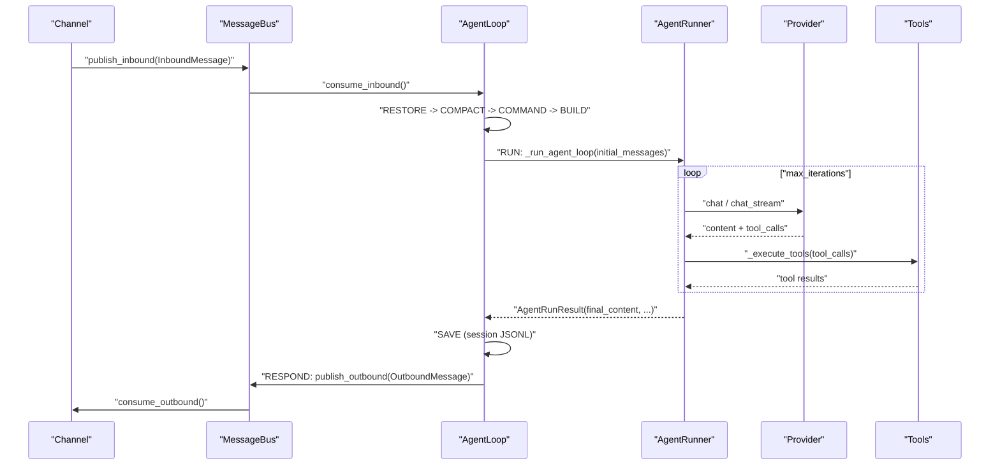

# 04. 에이전트 루프 — nanobot의 두뇌

> **이 문서에서 다루는 큰 맥락**
>
> nanobot의 심장은 두 개의 루프입니다. **바깥 루프 `AgentLoop`**(`nanobot/agent/loop.py`)는 메시지를
> 하나씩 받아 "한 턴(turn)"을 상태머신으로 처리합니다. **안쪽 루프 `AgentRunner`**(`nanobot/agent/runner.py`)는
> 한 턴 안에서 LLM[(용어사전)](../dict/08_ai_llm_concepts.md#llm) 호출 ↔ 도구 실행을 여러 번 반복합니다. 그 사이를 잇는 것이 `MessageBus`(`nanobot/bus/`)의
> inbound/outbound 큐입니다. 이 문서는 메시지 하나가 도착해서 응답이 나가기까지의 전 과정을
> **큰 흐름 → 상태머신 → 반복 루프 → 핵심 함수 라인바이라인** 순으로 분해합니다.

## 비유로 먼저 이해하기 — 팀장과 실무자의 업무 처리

이 문서는 nanobot의 심장부입니다. 등장인물은 딱 둘입니다.

- **팀장(`AgentLoop`)** — 접수함(MessageBus)에서 요청서를 **한 장씩** 꺼내, 정해진 순서로
  일을 진행합니다. 그 순서가 바로 "상태머신"입니다. 어렵게 들리지만 사실은
  **체크리스트**입니다: ① 이전 기록 펼치기(RESTORE) → ② 기록이 너무 길면 요약(COMPACT) →
  ③ 특별 지시(`/명령`)인지 확인(COMMAND) → ④ 자료 준비(BUILD) → ⑤ 실무자에게 맡기기(RUN) →
  ⑥ 결과 기록(SAVE) → ⑦ 답장 보내기(RESPOND) → 끝(DONE). 항상 이 순서대로만 진행되므로
  중간에 무엇이 잘못됐는지 추적하기 쉽습니다.
- **실무자(`AgentRunner`)** — ⑤ 단계에서 실제 일을 합니다. AI(Provider)에게 자료를 보여 주고
  "다음에 뭘 할까?"를 묻습니다. AI가 "이 파일 좀 읽어 줘"라고 하면 도구를 대신 실행해서
  결과를 다시 AI에게 보여 줍니다. AI가 "이제 최종 답변을 하겠다"라고 할 때까지
  이 **묻고-실행하고-다시 묻는 반복**을 계속합니다(무한 반복 방지를 위해 횟수 제한 있음).

왜 팀장과 실무자를 나눴을까요? 팀장은 "순서와 기록 관리"만, 실무자는 "AI와의 대화"만
맡게 해서 각자의 코드가 단순해지기 때문입니다. 여러분이 아래에서 읽을 코드도
이 두 역할 중 어느 쪽 일인지만 구분하면 길을 잃지 않습니다.

**꼭 가져가야 할 것 3가지**

1. 메시지 1개 처리 = "한 턴(turn)"이고, 턴은 RESTORE→…→DONE 체크리스트(상태머신)로 진행된다.
2. 턴 안에서 `AgentRunner`가 "LLM 호출 ↔ 도구 실행"을 여러 번 반복한다 (이것이 에이전트의 본질).
3. 채널과 에이전트는 서로를 모르고, 오직 MessageBus의 큐(줄 세우기)로만 소통한다.

---

## 이 문서의 소목차

1. [한 턴의 큰 흐름](#한-턴의-큰-흐름)
2. [메시지 자료구조: `bus/events.py`](#메시지-자료구조-buseventspy)
3. [메시지 버스: `bus/queue.py`](#메시지-버스-busqueuepy)
4. [`AgentLoop.run()` — 바깥 루프](#agentlooprun--바깥-루프)
5. [턴 상태머신: `TurnState`와 `_TRANSITIONS`](#턴-상태머신-turnstate와-_transitions)
6. [상태 핸들러 라인바이라인](#상태-핸들러-라인바이라인)
7. [`AgentRunner` — 안쪽 반복 루프](#agentrunner--안쪽-반복-루프)
8. [정리: 한 턴 시퀀스](#정리-한-턴-시퀀스)

---

## 한 턴의 큰 흐름

1. 채널이 `InboundMessage`를 만들어 `MessageBus`의 inbound 큐에 넣는다.
2. `AgentLoop.run()`이 큐에서 메시지를 꺼내(`consume_inbound`), 세션별로 태스크를 만들어 `_dispatch`한다.
3. `_dispatch` → `_process_message`가 **턴 상태머신**을 돈다: RESTORE → COMPACT → COMMAND → BUILD → RUN → SAVE → RESPOND → DONE.
4. RUN 단계에서 `AgentRunner.run()`이 LLM을 호출하고, LLM이 요청한 도구를 실행하며, 이를 반복한다.
5. 결과를 세션에 저장(SAVE)하고 `OutboundMessage`로 조립(RESPOND)해 outbound 큐로 내보낸다.

---

## 메시지 자료구조: `bus/events.py`

`nanobot/bus/events.py`는 버스를 오가는 두 dataclass를 정의합니다.

**`InboundMessage`** (L22-L38): 채널이 받은 메시지.
```python
@dataclass
class InboundMessage:
    channel: str        # telegram, discord, slack, whatsapp
    sender_id: str      # 사용자 식별자
    chat_id: str        # 채팅방/채널 식별자
    content: str        # 메시지 텍스트
    timestamp: datetime = field(default_factory=datetime.now)
    media: list[str] = field(default_factory=list)   # 미디어 URL
    metadata: dict[str, Any] = field(default_factory=dict)
    session_key_override: str | None = None
```
- `session_key` 프로퍼티(L35-L38): `session_key_override`가 있으면 그것을, 없으면 `f"{self.channel}:{self.chat_id}"`를
  세션 키로 씁니다. **왜?** 채널+채팅방 조합이 대화 세션의 자연스러운 경계이기 때문입니다.
  (thread 단위로 세션을 나누고 싶을 때 `session_key_override`를 씀. [06](06_state_and_persistence.md))

**`OutboundMessage`** (L41-L57): 채널로 보낼 응답. `content`, `reply_to`, `media`, `buttons`, 그리고
내부 UI/런타임 의미를 담는 `event`(L57)를 가집니다.

또한 파일 상단(L13-L19)에는 특수 메타데이터 키 상수들이 있습니다. 예: `INBOUND_META_RUNTIME_CONTROL`은
사용자 세션을 거치지 않고 런타임 상태(예: MCP[(용어사전)](../dict/08_ai_llm_concepts.md#mcp) 재로딩)를 갱신하라는 내부 신호입니다.

---

## 메시지 버스: `bus/queue.py`

`MessageBus`(L8-L44)는 채널과 에이전트 코어를 **분리(decouple)** 하는 두 큐입니다.

```python
class MessageBus:
    def __init__(self):
        self.inbound: asyncio.Queue[InboundMessage] = asyncio.Queue()
        self.outbound: asyncio.Queue[OutboundMessage] = asyncio.Queue()

    async def publish_inbound(self, msg): await self.inbound.put(msg)
    async def consume_inbound(self):     return await self.inbound.get()
    async def publish_outbound(self, msg): await self.outbound.put(msg)
    async def consume_outbound(self):     return await self.outbound.get()
```

- **왜 큐로 분리하나(설계 의도):** 채널은 "메시지를 넣고/꺼내는" 것만 알면 되고, 에이전트는 어느 채널에서
  왔는지 신경 쓸 필요가 없습니다. 새 채널을 추가해도 코어 코드를 바꿀 필요가 없어집니다(느슨한 결합).
- `asyncio.Queue`는 비동기 환경에서 생산자/소비자 속도 차이를 흡수하는 버퍼 역할도 합니다.

---

## `AgentLoop.run()` — 바깥 루프

`nanobot/agent/loop.py` L930-L1025. 핵심만 발췌해 라인바이라인으로 봅니다.

- **L934 `await self._connect_mcp()`** — 시작 시 MCP 서버에 연결(도구 확장; [05](05_tools.md)).
- **L937 `while self._running:`** — 종료 신호가 올 때까지 무한 반복.
- **L939 `msg = await asyncio.wait_for(self.bus.consume_inbound(), timeout=1.0)`** — inbound 큐에서
  1초 타임아웃으로 메시지를 기다립니다.
- **L940-L945 `except asyncio.TimeoutError:`** — 1초 동안 메시지가 없으면 `auto_compact.check_expired(...)`를
  호출해 **유휴 세션 압축**을 점검하고 다시 루프로. **왜 타임아웃을 두나:** 메시지가 없을 때도 주기적으로
  유지보수(idle 세션 압축)를 할 기회를 얻기 위함입니다([07](07_prompt_and_context.md)의 AutoCompact[(용어사전)](../dict/03_memory_context_session.md#autocompact)).
- **L956-L957** — `raw`(공백 제거한 내용)와 `effective_key`(실효 세션 키)를 계산.
- **L958-L959** — `handle_runtime_control(...)`이 True면(런타임 제어 메시지) 세션 처리 없이 continue.
- **L960-L965** — 우선순위 명령(예: `/stop`)은 태스크를 만들지 않고 **즉시** 인라인 처리(`_dispatch_command_inline`).
  **왜?** `/stop`은 실행 중인 태스크를 멈춰야 하므로 큐 뒤에서 기다리면 안 됩니다.
- **L966-L981** — automation turn coordinator가 "지금은 미뤄야 한다"고 하면 defer.
- **L985-L1012** — 해당 세션이 이미 처리 중이면(`effective_key in self._pending_queues`) 새 태스크 대신
  **진행 중인 턴에 메시지를 주입(injection)** 합니다(`put_nowait`, L1001). **왜?** 같은 세션의 메시지가
  동시에 두 개의 경쟁 태스크로 처리되면 대화 순서가 꼬입니다. 한 세션은 직렬로 처리합니다.
- **L1015-L1016** — 그 외에는 `asyncio.create_task(self._dispatch(msg))`로 **비동기 태스크**를 만들어 등록.
  **왜 태스크로 dispatch하나:** 한 세션이 오래 걸려도 루프가 막히지 않고 `/stop` 등에 계속 응답하기 위함입니다
  (docstring L931 "dispatching messages as tasks to stay responsive to /stop").
- **L1017-L1022** — 태스크 완료 시 등록 목록에서 자동 제거하는 콜백.

즉 `run()`의 핵심 설계는 **"세션 간 동시성(concurrent), 세션 내 직렬성(serial)"** 입니다
(`_dispatch` docstring L1028 "per-session serial, cross-session concurrent").

---

## 턴 상태머신: `TurnState`와 `_TRANSITIONS`

> **쉽게 말하면:** 상태머신이란 "지금 어느 단계인지"를 이름표(상태)로 들고 다니며, 표에 적힌 대로만 다음 단계로 넘어가는 방식입니다. 요리 레시피의 순서표라고 생각하면 됩니다 — 순서를 건너뛰거나 뒤섞을 수 없어서 버그를 찾기 쉽습니다.

한 메시지 처리는 명시적 상태머신으로 표현됩니다.

`TurnState`(L167 부근, enum):
```python
class TurnState(Enum):
    RESTORE = auto()
    COMPACT = auto()
    COMMAND = auto()
    BUILD = auto()
    RUN = auto()
    SAVE = auto()
    RESPOND = auto()
    DONE = auto()
```

`_TRANSITIONS` 전이표(L183-L192):
```python
_TRANSITIONS = {
    (TurnState.RESTORE, "ok"): TurnState.COMPACT,
    (TurnState.COMPACT, "ok"): TurnState.COMMAND,
    (TurnState.COMMAND, "dispatch"): TurnState.BUILD,
    (TurnState.COMMAND, "shortcut"): TurnState.DONE,
    (TurnState.BUILD, "ok"): TurnState.RUN,
    (TurnState.RUN, "ok"): TurnState.SAVE,
    (TurnState.SAVE, "ok"): TurnState.RESPOND,
    (TurnState.RESPOND, "ok"): TurnState.DONE,
}
```

**드라이버**는 `_process_message`(L1308-L1408)에 있습니다.
- L1356 `while ctx.state is not TurnState.DONE:` — DONE이 될 때까지 반복.
- L1357-L1358 — 현재 상태 이름으로 핸들러(`_state_restore` 등)를 찾습니다(`getattr`).
- L1364 `event = await handler(ctx)` — 핸들러 실행 → 이벤트 문자열("ok"/"dispatch"/"shortcut") 반환.
- L1395 `next_state = self._TRANSITIONS.get((ctx.state, event))` — 전이표에서 다음 상태를 찾음.
- L1396-L1400 — 전이가 없으면 명시적으로 에러(잘못된 상태 조합 방지). 트레이스도 기록(L1367-L1386).

**왜 상태머신인가(설계 의도):** 한 턴에는 "체크포인트 복원 → 압축 → 명령 처리 → 컨텍스트 구축 → 실행 →
저장 → 응답"이라는 뚜렷한 단계가 있습니다. 이를 명시적 상태와 전이표로 만들면 흐름을 눈으로 검증할 수 있고,
`COMMAND`에서 "shortcut"이면 곧장 DONE으로 빠지는 등 분기를 안전하게 표현할 수 있습니다.

---

## 상태 핸들러 라인바이라인

### RESTORE — `_state_restore` (L1445-L1469)
- L1449-L1452 — 미디어가 있으면 문서 텍스트 추출/이미지 분리(`_prepare_message_media`).
- L1459-L1460 — 세션이 없으면 `sessions.get_or_create(session_key)`로 확보.
- L1464-L1467 — 이전에 중단된 런타임 **체크포인트**나 미완료 사용자 턴을 복원(있으면 저장).
  **왜?** 실행 도중 프로세스가 죽어도 다음에 이어갈 수 있게 하기 위함입니다.

### COMPACT — `_state_compact` (L1481-L1484)
- `auto_compact.prepare_session(...)`으로 세션을 준비하고, 유휴 압축이 걸려 있었다면 이전 요약(`pending_summary`)을
  받아 둡니다([07](07_prompt_and_context.md)의 AutoCompact).

### COMMAND — `_state_command` (L1486-L1509)
- L1491 `result = await self.commands.dispatch(cmd_ctx)` — 슬래시 명령이면 처리 결과를 받음.
- 결과가 있으면(명령이었음) L1493 `ctx.outbound = result` 후 L1508 `return "shortcut"` → BUILD/RUN을 건너뛰고 DONE.
  다만 `/new`가 아니면 사용자/어시스턴트 메시지를 `_command=True` 표시와 함께 저장(L1499-L1507)해 WebUI[(용어사전)](../dict/05_channels_gateway_ui.md#webui) 이력에 남깁니다.
- 명령이 아니면 L1509 `return "dispatch"` → BUILD로 진행.

### BUILD — `_state_build` (L1511-L1555)
- L1512-L1516 — ephemeral(임시)이 아니면 토큰 기준 이력 통합(`maybe_consolidate_by_tokens`)을 미리 수행.
- L1517-L1523 — 도구 컨텍스트(channel/chat_id/metadata)를 설정.
- L1528-L1533 `ctx.history = ctx.session.get_history(...)` — 세션에서 최근 이력을 가져옴(메시지/토큰 상한 적용).
- L1539-L1545 `ctx.initial_messages = self._build_initial_messages(...)` — **LLM에 보낼 최초 메시지 배열**을 조립
  (시스템 프롬프트 + 이력 + 현재 메시지; [07](07_prompt_and_context.md)에서 상세).
- L1546-L1548 — 사용자 메시지를 미리 저장(`_persist_user_message_early`). **왜?** 실행이 중간에 실패해도
  사용자 발화는 이력에 남겨야 하기 때문입니다.
- L1550-L1553 — 진행 상황/재시도 대기 콜백을 버스로 연결.

### RUN — `_state_run` (L1557-L1591)
- L1560-L1565 — 실행 상태를 "running"으로 알림(런타임 이벤트).
- L1566-L1583 `result = await self._run_agent_loop(...)` — **여기서 안쪽 루프가 돈다**(아래 절).
- L1584-L1589 — 결과 언패킹: `final_content`, `tools_used`, `all_msgs`, `stop_reason`, `had_injections`.
- L1590 `await turn_continuation.maybe_continue_turn(ctx)` — 지속 목표(sustained goal) 등으로 턴을 이어야 하면 처리.

### SAVE — `_state_save` (L1593-L1630)
- L1596-L1600 — 최종 응답이 비어 있고 억제(suppress)도 아니면 기본 메시지(`EMPTY_FINAL_RESPONSE_MESSAGE`)로 채움.
- L1602-L1608 — 턴 지연시간(latency) 계산.
- L1609-L1612 `self._save_turn(...)` — **이번 턴에서 새로 생긴 메시지만** 세션에 저장.
- L1617-L1626 — ephemeral이 아니면 파일 상한 적용 후, 백그라운드로 토큰 기준 통합을 예약.
- L1629 `self.sessions.save(ctx.session)` — 세션을 디스크(JSONL[(용어사전)](../dict/03_memory_context_session.md#jsonl))에 기록([06](06_state_and_persistence.md)).

### RESPOND — `_state_respond` (L1632-L1644+)
- 응답 억제면 `outbound = None`.
- 아니면 `_assemble_outbound(...)`로 `OutboundMessage`를 조립합니다. 이후 이 메시지가 버스 outbound로 나가
  채널이 전송합니다.

---

## `AgentRunner` — 안쪽 반복 루프

> **쉽게 말하면:** 여기부터가 "AI에게 묻고 → 도구를 대신 실행해 주고 → 결과를 보여 주며 다시 묻는" 반복의 실제 코드입니다. AI가 "도구 필요 없음, 최종 답변!"이라고 할 때까지, 또는 반복 한도에 걸릴 때까지 돕니다.

`_state_run`이 부르는 `AgentLoop._run_agent_loop()`(L725-L928)는 실행 스펙(`AgentRunSpec`)을 만들어
`self.runner.run(...)`(L873)에 넘깁니다. 실제 반복은 `AgentRunner._run_core()`(`nanobot/agent/runner.py` L344)에 있습니다.

`AgentRunSpec`(runner.py L76-L106)은 한 실행에 필요한 모든 설정을 담는 dataclass입니다:
`initial_messages`, `tools`, `model`, `max_iterations`, `max_tool_result_chars`, 폴백/스트리밍/체크포인트 콜백 등.

### `_run_core`의 반복 (runner.py L377~)
- **L377 `for iteration in range(spec.max_iterations):`** — LLM↔도구 반복의 **상한**. 무한 루프 방지.
- **L383-L387** — `context_governor.prepare_for_model(...)`로 모델에 보낼 메시지를 정돈(압축/복구).
  실패 시 최소 복구 경로(L394-L408)로 폴백. **왜?** 저장된 원본 대화는 건드리지 않고, 모델에 보낼 사본만
  압축/수선하기 위함입니다(저장 경계 보존).
- **L415 `response = await self._request_model(...)`** — 프로바이더에 요청(스트리밍 포함).
- **L419-L424** — 응답에서 reasoning(사고)과 실제 content를 분리(`extract_reasoning`).
- **L433 `if response.should_execute_tools:`** — LLM이 도구 호출을 요청한 경우:
  - L438-L444 — 어시스턴트 메시지(도구 호출 포함)를 대화에 append.
  - L445-L455 — "도구 대기" 체크포인트 기록.
  - L459-L464 `results, new_events, fatal_error = await self._execute_tools(...)` — **도구 실행**([05](05_tools.md)).
  - L466-L470 — 성공한 도구 이름을 `tools_used`에 기록.
  - L473-L487 — 각 도구 결과를 `{"role": "tool", ...}` 메시지로 append(정규화 적용).
  - L488-L504 — 치명적 오류면 종료 처리, 아니면
  - L518-L526 — 주입(injection) 큐를 비우고(서브에이전트 결과 등) `continue`로 다음 반복.
  **즉 "도구를 실행한 뒤 그 결과를 넣고 다시 LLM에게" 반복**합니다. 이것이 tool-calling 에이전트의 핵심 루프입니다
  ([tech_background/01](tech_background/01_tool_calling_agents.md)).
- **L528-L534** — finish_reason이 에러인데 도구 호출이 섞여 온 경우 경고 후 무시.
- **L535-L566** — content가 비면 재시도(`_MAX_EMPTY_RETRIES = 2`, L67), 그래도 비면 finalization 재시도.
- **L568-L** — finish_reason이 "length"(길이 초과)면 이어쓰기 복구(`_MAX_LENGTH_RECOVERIES = 3`, L68).

반복이 끝나면 `AgentRunResult`(runner.py L109-L120)로 결과를 돌려줍니다:
`final_content`, `messages`, `tools_used`, `usage`, `stop_reason`, `error`, `tool_events`, `had_injections`.

### 폴백과 재시도
`AgentLoop._run_agent_loop`은 `runner_wall_llm_timeout_s(...)`로 LLM 타임아웃을 계산(L894-L899)하고,
`result.stop_reason`이 `"max_iterations"`면 경고(L913-L914), `"error"`면 로깅(L926-L927)합니다.
프로바이더 수준 폴백(모델 A 실패 시 B로)은 `FallbackProvider`가 담당합니다([09](09_providers.md)).

---

## 정리: 한 턴 시퀀스



- 도구 계층을 깊게 보려면 → [05_tools.md](05_tools.md)
- 세션 저장/압축을 보려면 → [06_state_and_persistence.md](06_state_and_persistence.md)
- `initial_messages`가 어떻게 조립되는지 → [07_prompt_and_context.md](07_prompt_and_context.md)
